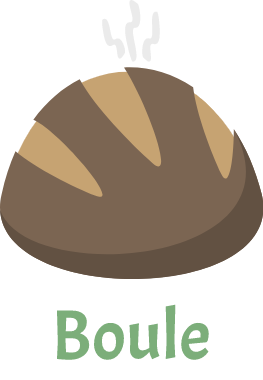

# Boule

A simple tracker for your baking progression. 

## Purpose
**Boule** serves two purposes for me. First, I am a developer and want to
learn a new domain. Mobile programming and the React paradigm are two skills
that seem both fun to develop, and practical for my personal growth. Second
(and perhaps more importantly), I want to become a better baker. I want to
perfect a recipe for a levain bread, and dream of one day opening a
bakery/coffee shop and settling down from the life of a developer. Baking is
a surprisingly active process, and the thought of making people's mornings
with good coffee and delicious bread appeals to me.

So, with that, **Boule** is my outlet for becoming a more well-rounded
programmer, and a step towards figuring out a new direction for my future.

## Developing
**Boule** is implemented in [TypeScript](https://www.typescriptlang.org/), and
is built on top of [Expo](https://expo.io/) and
[React-Native](https://facebook.github.io/react-native/). To build and run
**Boule**, follow the steps below.
 1. Clone this repository:
    - `git clone https://github.com/baxtersa/boule.git`
 2. Install dependencies:
    - `yarn install`
 3. Compile the sources:
    - `yarn tsc`
 4. Launch the expo client:
    - `yarn start`

You may find it useful to configure `tsc` to watch for changes and
automatically recompile (`yarn tsc -w`), which nicely integrates with Expo's
support for live reloading.